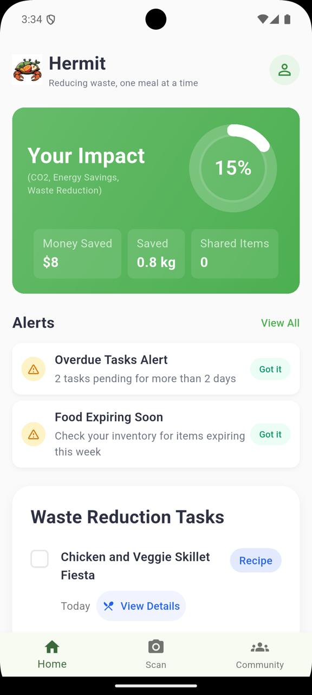
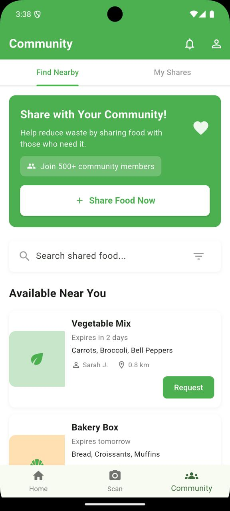
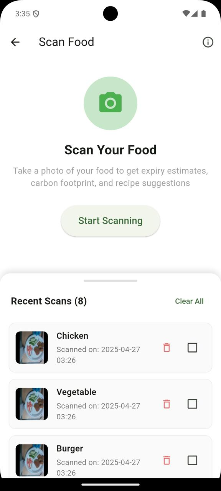
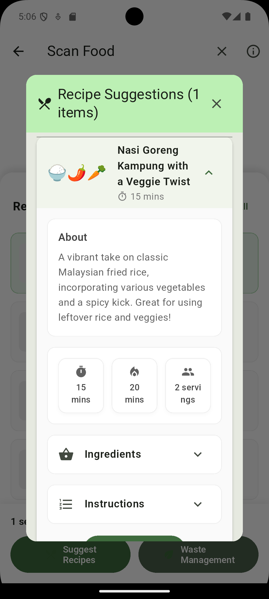
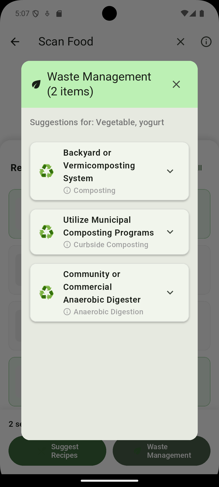
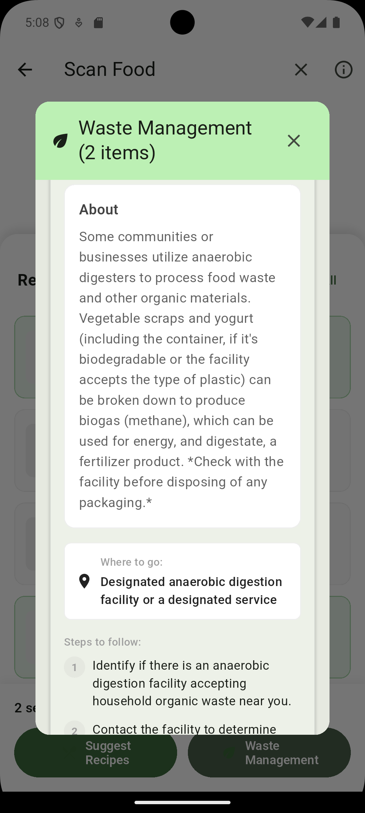

<div align="center">
  
  
  <h1>Hermit: Food Waste Reducer</h1>
  <p><b>Reduce food waste. Save money. Help your community.</b></p>
  <p>
    
    
    
  </p>
</div>

---

Hermit is a beautifully designed Flutter application to help Malaysians reduce food waste, save money, and build a sustainable community. Hermit empowers you to track your food, discover creative recipes, analyze environmental impact, and share surplus food with your neighbors.

---

## 🌟 Features

- 🏠 **Home Dashboard**: Overview of your food inventory, reminders, and impact stats.
- 📦 **Food Tracking**: Add, edit, and manage your food items with expiry alerts.
- 🤳 **Food Scanner**: Instantly detect and log food items using your camera.
- 🍳 **Recipe Suggestions**: Get creative, AI-powered Malaysian recipes based on your leftovers.
- 🌱 **Sustainability Analysis**: See the carbon footprint and get storage tips for each food item.
- 🤝 **Community Sharing**: Share surplus food or request items from neighbors to fight waste together.
- 📊 **Impact Metrics**: Track your environmental savings, money saved, and food shared.

---

## 🖼️ Screenshots

| Home Screen | Community Screen | Scan Screen |
|:-----------:|:---------------:|:-----------:|
|  |  |  |
| <sub><b>Overview & Stats</b></sub> | <sub><b>Share & Request Food</b></sub> | <sub><b>Detect Food</b></sub> |

| Suggest Recipe | Waste Management | Waste Management Description |
|:--------------:|:----------------:|:---------------------------:|
|  |  |  |
| <sub><b>AI Recipes</b></sub> | <sub><b>Waste Sorting</b></sub> | <sub><b>Eco Tips</b></sub> |

---

## 🚀 How It Works

1. **Track Your Food**: Add food items, set expiry dates, and get timely reminders.
2. **Scan & Detect**: Use your camera to recognize and log food instantly.
3. **Get Recipes**: Let Hermit suggest delicious Malaysian recipes using your leftovers.
4. **Analyze Impact**: See the environmental footprint of your food and get storage tips.
5. **Share with Community**: Offer surplus food or request what you need from nearby users.
6. **See Your Impact**: Monitor how much waste and money you've saved!

---

## 🛠️ Getting Started

### Prerequisites
- [Flutter SDK](https://docs.flutter.dev/get-started/install) (Dart 3.0.0+)
- Android/iOS device or emulator

### Installation
1. **Clone the repo:**
   ```bash
   git clone <your-repo-url>
   cd hermit
   ```
2. **Install dependencies:**
   ```bash
   flutter pub get
   ```
3. **Configure environment:**
   - Add your API keys and settings to `.env` (see `.env.example` if provided).
   - Ensure all assets are listed in `pubspec.yaml`.
4. **Run the app:**
   ```bash
   flutter run
   ```

### Troubleshooting
- If you encounter issues with dependencies, run `flutter clean` then `flutter pub get`.
- For camera/permissions issues, check your device settings and emulator configuration.

---

## ⚙️ Configuration
- **API Keys**: Place your generative AI and Firebase keys in the `.env` file.
- **Assets**: All images and screenshots are in the `assets/` directory and referenced in `pubspec.yaml`.

---

## 📦 Dependencies
| Package | Purpose |
|---------|---------|
| flutter | Core framework |
| cupertino_icons | iOS-style icons |
| http | Networking |
| image_picker | Camera/gallery access |
| google_generative_ai | AI recipe suggestions |
| flutter_dotenv | Environment variables |
| shared_preferences | Local storage |
| path_provider | File system paths |
| firebase_core | Firebase integration |
| cloud_firestore | Cloud database |

---

## 🤔 FAQ

**Q: Is Hermit free?**  
A: Yes, Hermit is open-source and free to use.

**Q: Does Hermit work offline?**  
A: Most features work offline, but sharing and AI require an internet connection.

**Q: How do I contribute?**  
A: Fork the repo, make your changes, and open a pull request!

---

## 🙋 Contact & Support
- For issues, open a [GitHub issue](https://github.com/your-repo/issues).
- For feature requests or questions, contact the maintainer at [your-email@example.com].

---

## 🙌 Contributors
- Adiba Alya
- Hadi Ilhan
- Nur Aisyah
- Nurul Azween

---

<div align="center">
  <b>Special thanks to <a href="https://jomhack.com/varsitychallenge/">JomHack Varsity Hackathon</a> for this amazing opportunity! 🚀</b>
</div>

---

## 📄 License
This project is licensed under the [MIT License](LICENSE).

---
<div align="center">
  <sub>Made with ❤️ for a greener Malaysia</sub>
</div>
